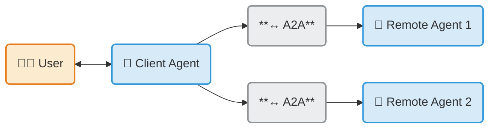

---
hide:
  - navigation
  - toc
---

# Agent2Agent (A2A) Protocol

<figure class="hero" markdown>
  {width="70%"}
  <figcaption>
    The <strong>Agent2Agent (A2A) Protocol</strong> is an open standard
    designed to enable seamless communication and collaboration between AI agents. 
    In a world where agents are built using diverse frameworks and by different vendors,
    A2A provides a common language, breaking down silos and fostering interoperability.
   </figcaption>
</figure>

!!! abstract ""
    Build with
    **[{class="twemoji lg middle"} ADK](https://google.github.io/adk-docs/)** _(or any framework)_,
    equip with **MCP** _(or any tool)_,
    and communicate with
    **{class="twemoji sm middle"} A2A**,
    to remote agents, local agents, and humans.

- :material-lightbulb-outline:{ .lg .middle } **A2A** Announcements

    Ramp up quickly

    [:octicons-arrow-right-24: Announcing the A2A Protocol (Apr)](https://developers.googleblog.com/en/a2a-a-new-era-of-agent-interoperability/)
    our initial blog

    [:octicons-arrow-right-24: Agents are not tools (Jun)](https://www.googlecloudcommunity.com/gc/Community-Blogs/Agents-are-not-tools/ba-p/922716)
    our TL thought piece

    [:octicons-arrow-right-24: Google Cloud donates A2A to Linux Foundation (Jun)](https://developers.googleblog.com/en/google-cloud-donates-a2a-to-linux-foundation/)
    covered by [Forbes](https://www.forbes.com/sites/janakirammsv/2025/06/25/key-tech-firms-unite-as-google-donates-a2a-to-linux-foundation/)

    Dive deep with end to end examples

    [:octicons-arrow-right-24: Designing with A2A (O'Reilly)](https://www.oreilly.com/radar/designing-collaborative-multi-agent-systems-with-the-a2a-protocol/)

    [:octicons-arrow-right-24: Start the Python Tutorial](tutorials/python/1-introduction.md)

- :material-play-circle:{ .lg .middle } **Video** Intro in <8 min

    <iframe width="560" height="315" src="https://www.youtube.com/embed/Fbr_Solax1w?si=QxPMEEiO5kLr5_0F" title="YouTube video player" frameborder="0" allow="accelerometer; autoplay; clipboard-write; encrypted-media; gyroscope; picture-in-picture; web-share" referrerpolicy="strict-origin-when-cross-origin" allowfullscreen></iframe>

## Why A2A Matters

- :material-account-group-outline:{ .lg .middle } **Interoperability**

    Connect agents built on different platforms (LangGraph, CrewAI, Semantic Kernel, custom solutions) to create powerful, composite AI systems.

- :material-lan-connect:{ .lg .middle } **Complex Workflows**

    Enable agents to delegate sub-tasks, exchange information, and coordinate actions to solve complex problems that a single agent cannot.

- :material-shield-key-outline:{ .lg .middle } **Secure & Opaque**

    Agents interact without needing to share internal memory, tools, or proprietary logic, ensuring security and preserving intellectual property.

---

## A2A and MCP: Complementary Protocols

{width="60%"}
{style="text-align: center; margin-bottom:1em; margin-top:1em;"}

A2A and the [Model Context Protocol (MCP)](https://modelcontextprotocol.io/) are complementary standards for building robust agentic applications:

- **MCP (Model Context Protocol):** Connects agents to **tools, APIs, and resources** with structured inputs/outputs. Think of it as the way agents access their capabilities.
- **A2A (Agent2Agent Protocol):** Facilitates **dynamic, multimodal communication between different agents** as peers. It's how agents collaborate, delegate, and manage shared tasks.

[Learn more about A2A and MCP](./topics/a2a-and-mcp.md)

---

## A2A Resources

- :material-book-open:{ .lg .middle } **Read the Introduction**

    Understand the core ideas behind A2A.

    [:octicons-arrow-right-24: What is A2A?](./topics/what-is-a2a.md)

    [:octicons-arrow-right-24: Key Concepts](./topics/key-concepts.md)

- :material-file-document-outline:{ .lg .middle } **Dive into the Specification**

    Explore the detailed technical definition of the A2A protocol.

    [:octicons-arrow-right-24: Protocol Specification](./specification.md)

- :material-application-cog-outline:{ .lg .middle } **Follow the Tutorials**

    Build your first A2A-compliant agent with our step-by-step Python quickstart.

    [:octicons-arrow-right-24: Python Tutorial](./tutorials/python/1-introduction.md)

- :material-code-braces:{ .lg .middle } **Explore Code Samples**

    See A2A in action with sample clients, servers, and agent framework integrations.

    [:fontawesome-brands-github: GitHub Samples](https://github.com/a2aproject/a2a-samples)

- :material-code-braces:{ .lg .middle } **Download the SDK**

    [:fontawesome-brands-python: Python](https://github.com/a2aproject/a2a-python)

    [:fontawesome-brands-js: JavaScript](https://github.com/a2aproject/a2a-js)

    [:fontawesome-brands-java: Java](https://github.com/a2aproject/a2a-java)

    [:octicons-code-24: C#/.NET](https://github.com/a2aproject/a2a-dotnet)

    [:fontawesome-brands-golang: Golang](https://github.com/a2aproject/a2a-go)

