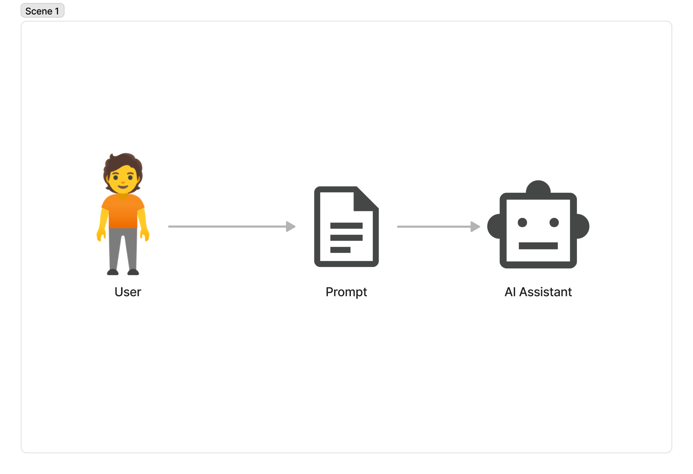
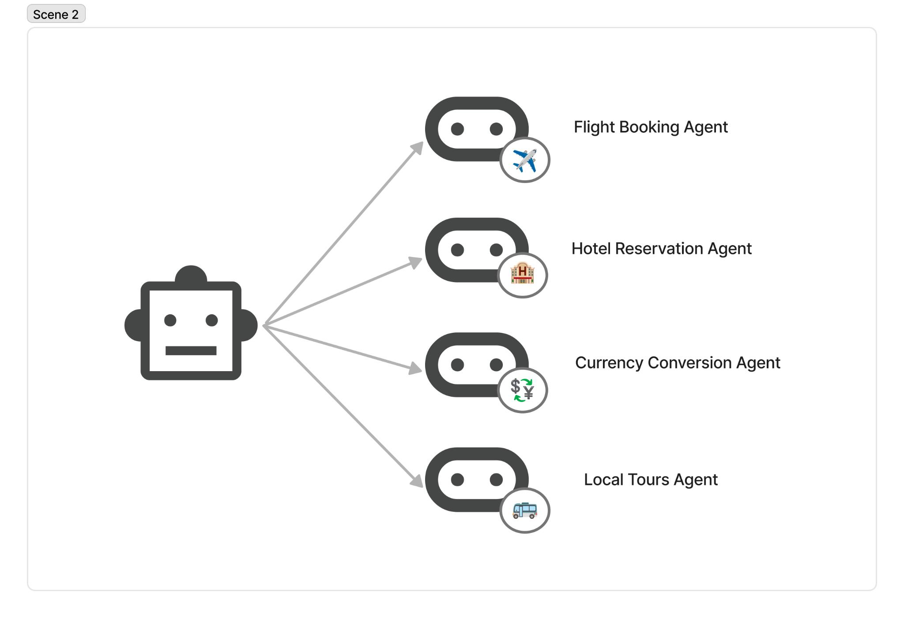
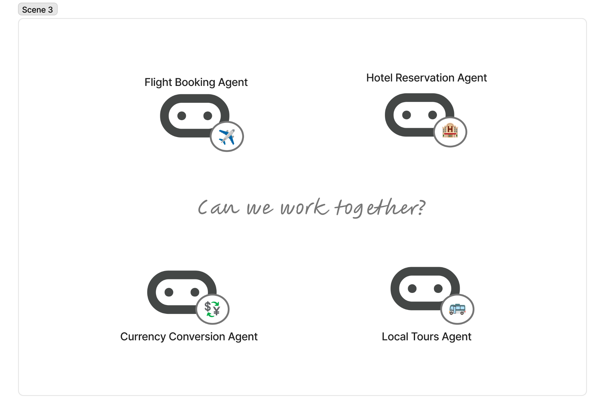
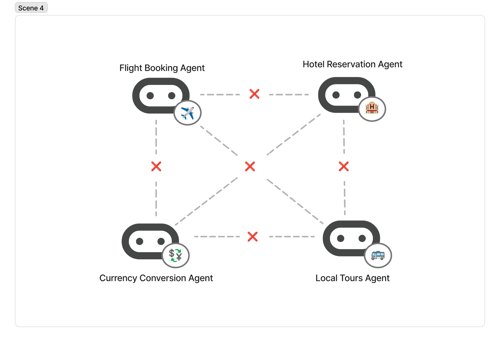
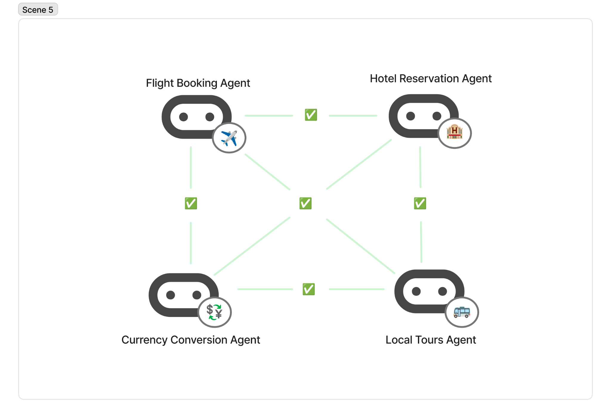
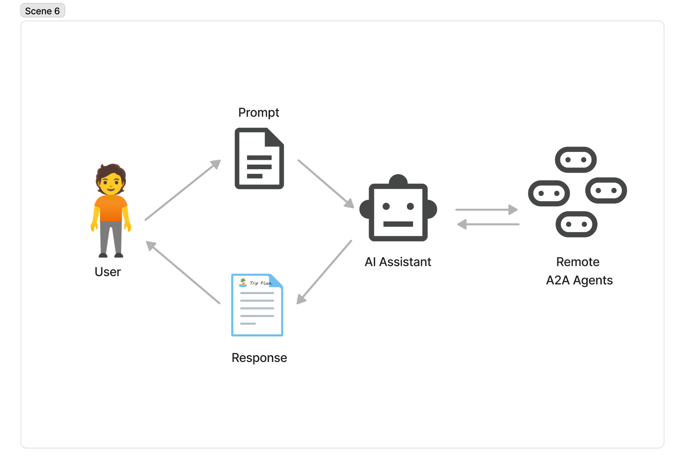
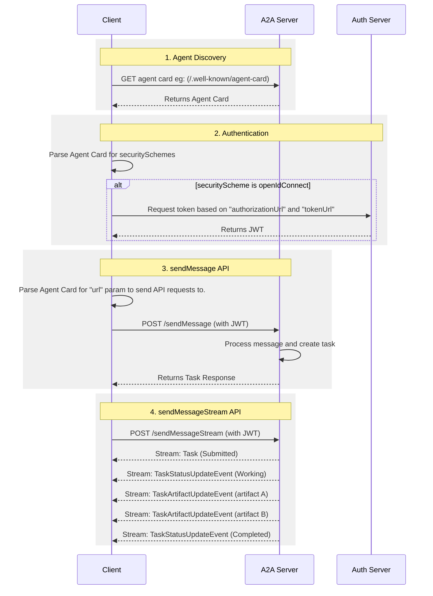

# A2A Protocol Overview

The A2A protocol is an open standard that enables seamless communication and
collaboration between AI agents. It provides a common language for agents built
using diverse frameworks and by different vendors, fostering interoperability
and breaking down silos. Agents are autonomous problem-solvers that act
independently within their environment. A2A allows agents from different
developers, built on different frameworks, and owned by different organizations
to unite and work together.

## Why Use the A2A Protocol

A2A addresses key challenges in AI agent collaboration. It provides
a standardized approach for agents to interact. This section explains the
problems A2A solves and the benefits it offers.

### Problems that A2A Solves

Consider a user request for an AI assistant to plan an international trip. This
task involves orchestrating multiple specialized agents, such as:

*   A flight booking agent
*   A hotel reservation agent
*   An agent for local tour recommendations
*   A currency conversion agent

Without A2A, integrating these diverse agents presents several challenges:

*   **Custom integrations**: Each interaction requires custom, point-to-point
    solutions, creating significant engineering overhead.
*   **Slow innovation**: Bespoke development for each new integration slows
    innovation.
*   **Scalability issues**: Systems become difficult to scale and maintain as
    the number of agents and interactions grows.
*   **Limited interoperability**: This approach limits interoperability,
    preventing the organic formation of complex AI ecosystems.
*   **Security Gaps**: Ad hoc communication often lacks consistent security
    measures.

The A2A protocol addresses these challenges by establishing interoperability for
AI agents to interact reliably and securely.

### A2A Example Scenario
This section provides an example scenario to illustrate the benefits of using an A2A (Agent-to-Agent) protocol for complex interactions between AI agents.

#### Scene 1: A User's Complex Request

A user interacts with an AI assistant, giving it a complex prompt like "Plan an international trip."

{ width="70%" style="margin:20px auto;display:block;" }

#### Scene 2: The Need for Collaboration

The AI assistant receives the prompt and realizes it needs to call upon multiple specialized agents to fulfill the request. These agents include a Flight Booking Agent, a Hotel Reservation Agent, a Currency Conversion Agent, and a Local Tours Agent.

{ width="70%" style="margin:20px auto;display:block;" }

#### Scene 3: The Interoperability Challenge

The core problem: The agents are unable to work together because each has its own bespoke development and deployment.

{ width="70%" style="margin:20px auto;display:block;" }

#### Scene 4: The "Without A2A" Problem

The consequence of a lack of a standardized protocol is that these agents cannot collaborate with each other let alone discover what they can do. The individual agents (Flight, Hotel, Currency, and Tours) are isolated. Symbols like "X" indicate failed communication or incompatibility between them, representing the **significant engineering overhead** and **limited interoperability** of point-to-point solutions.

{ width="70%" style="margin:20px auto;display:block;" }

#### Scene 5: The "With A2A" Solution

The same agents are now shown as an interconnected system, communicating seamlessly through the standardized protocol (A2A). This represents how the protocol addresses the challenges of scalability and security.

{ width="70%" style="margin:20px auto;display:block;" }

#### Scene 6: The Cohesive Result

The AI assistant, now acting as an orchestrator, receives the cohesive information from all the A2A-enabled agents. It then presents a single, complete travel plan as a seamless response to the user's initial prompt.

{ width="70%" style="margin:20px auto;display:block;" }

### Core Benefits of A2A

Implementing the A2A protocol offers significant advantages across the AI ecosystem:

*   **Increased interoperability**: A2A breaks down silos between different AI
    agent ecosystems, enabling agents from various vendors and frameworks to work
    together seamlessly.
*   **Enhanced agent capabilities**: A2A allows developers to create more
    sophisticated applications by composing the strengths of multiple
    specialized agents.
*   **Reduced integration complexity**: The protocol standardizes agent
    communication, enabling teams to focus on the unique value their agents
    provide.
*   **Fostered innovation**: A2A encourages the development of a richer
    ecosystem of specialized agents that can readily plug into larger
    collaborative workflows.
*   **Future-proofing**: The protocol provides a flexible framework that adapts
    as AI agent technologies continue to evolve.

### Key Design Principles of A2A

A2A development follows principles that prioritize broad adoption,
enterprise-grade capabilities, and future-proofing.

*   **Simplicity**: A2A leverages existing standards like HTTP, JSON-RPC, and
    Server-Sent Events (SSE). This avoids reinventing core technologies and
    accelerates developer adoption.
*   **Enterprise readiness**: A2A addresses critical enterprise needs. It aligns
    with standard web practices for robust authentication, authorization,
    security, privacy, tracing, and monitoring.
*   **Asynchronous first**: A2A natively supports long-running tasks. It handles
    scenarios where agents or users might not remain continuously connected. It
    uses mechanisms like streaming and push notifications.
*   **Modality independent**: The protocol allows agents to communicate using a
    wide variety of content types. This enables rich and flexible interactions
    beyond plain text.
*   **Opaque execution**: Agents collaborate effectively without exposing their
    internal logic, memory, or proprietary tools. Interactions rely on declared
    capabilities and exchanged context. This preserves intellectual property and
    enhances security.

### A2A in the Broader AI Ecosystem

A2A fits into a larger agentic stack:

*   **A2A protocol**: Standardizes communication across agents deployed in different
    organizations and built on different frameworks.
*   **MCP**: Connects models to data and external resources.
*   **Frameworks (like ADK)**: Provide a toolkit to assemble your agent.
*   **Models**: Fundamental to an agent's reasoning, these include any Large
    Language Model (LLM).

### A2A and ADK 

The [Agent Development Kit (ADK)](/application-integration/docs/agents/about-adk)
is an open source agent development toolkit developed by Google. A2A is a
communication protocol for agents that helps agents communicate with each other,
regardless of the framework used to build them (for example, ADK, Langgraph, or
Crew AI). ADK is a flexible and modular framework for developing and deploying
AI agents. While optimized for {{gemini_name}} and the Google ecosystem, ADK is
model-agnostic, deployment-agnostic, and built for compatibility with other
frameworks.

### A2A Request Lifecycle

The A2A request lifecycle is a sequence that details the four main steps a request follows: agent discovery, authentication, `sendMessage` API, and `sendMessageStream` API. The following diagram provides a deeper look into the operational flow, illustrating the interactions between the client, A2A server, and auth server.

## What's next

Learn about the [Key Concepts](./key-concepts.md) that form the foundation of the A2A protocol.
